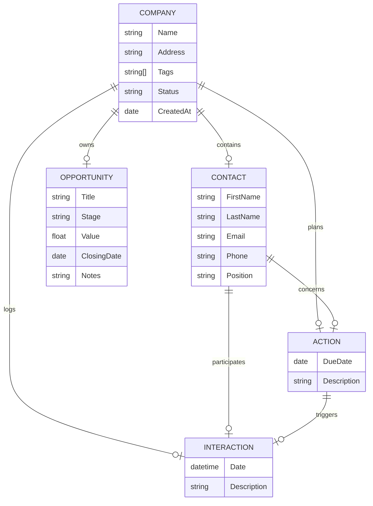

# Hunt - Data Schema & Architecture

Welcome to the internal data documentation for **Hunt**. This guide outlines how data is organized, structured, and linked together in our custom file format.

---

## Overview

Hunt uses a lightweight, custom binary storage model designed for blazing-fast performance and zero bloat. Data is stored in individual chunks, where each record type follows a predictable layout containing a standard header (`ChunkHeader`), size-prefixed fields, and strict typing.

---

## Entity-Relationship Diagram

Here is how the core business entities connect to each other:

---

## Core Types & Structures

### 1. Global Magic & Headers

Every data file starts with a fixed 4-byte magic signature to ensure file integrity, followed by chunks that use a common header:

* **`MAGIC`**: `[ 'H', 'U', 'N', 'T' ]` (4 bytes)
* **`ChunkHeader`**:
* `chunksize` (`u32`): Total size of the current chunk in bytes.
* `id` (`u32`): Unique identifier for the record.

---

### 2. Company

Represents an organization or business client you are tracking.

* **`head`**: Chunk header (`ChunkHeader`)
* **`name`**: Company name (prefixed by `name_size` as `u8`)
* **`address`**: Physical address (prefixed by `adress_size` as `u16`)
* **`tags`**: List of custom labels, preceded by `tags_length` (`u8`), where each tag contains its own size (`u8`) and title string.
* **`status`**: Current pipeline lifecycle state (`u8` enum: `PROSPECT`, `CLIENT`, `STALE`, `DEAD`)
* **`created_at`**: Creation timestamp (`u64`)

---

### 3. Contact

Represents an individual person working at or associated with a Company.

* **`head`**: Chunk header (`ChunkHeader`)
* **`company_id`**: Associated company identifier (`u32`)
* **`first_name`**: First name (prefixed by `first_name_size` as `u8`)
* **`last_name`**: Last name (prefixed by `last_name_size` as `u8`)
* **`email`**: Email address (prefixed by `email_size` as `u16`)
* **`phone`**: Phone number (prefixed by `phone_size` as `u8`)
* **`position`**: Job title/role (prefixed by `position_size` as `u8`)

---

### 4. Action

A scheduled task, to-do, or planned touchpoint.

* **`head`**: Chunk header (`ChunkHeader`)
* **`company_id`**: Associated company identifier (`u32`)
* **`contact_id`**: Associated contact identifier (`u32`)
* **`due_date`**: Timestamp for when the action is due (`u64`)
* **`desc`**: Task description or notes (prefixed by `desc_size` as `u32`)

---

### 5. Interaction

An actual log of an event that happened (e.g., a call, meeting note, or email summary), optionally tied back to a planned action.

* **`head`**: Chunk header (`ChunkHeader`)
* **`contact_id`**: Associated contact identifier (`u32`)
* **`action_id`**: Associated action identifier (`u32`)
* **`date`**: Timestamp of when the interaction occurred (`u64`)
* **`desc`**: Summary or notes of what happened (prefixed by `desc_size` as `u32`)

---

### 6. Opportunity

A potential business deal or sales pipeline entry.

* **`head`**: Chunk header (`ChunkHeader`)
* **`company_id`**: Associated company identifier (`u32`)
* **`contact_id`**: Associated contact identifier (`u32`)
* **`value`**: Financial value of the deal in cents (`u32`)
* **`stage`**: Current sales stage (`u8` enum: `DISCOVERY`, `PROPOSAL`, `NEGOTIATION`, `WON`, `LOST`)
* **`closing_date`**: Estimated closing timestamp (`u64`)
* **`title`**: Opportunity name/title (prefixed by `title_size` as `u8`)
* **`desc`**: Details or context (prefixed by `desc_size` as `u32`)
